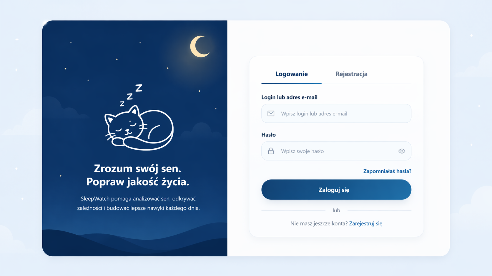
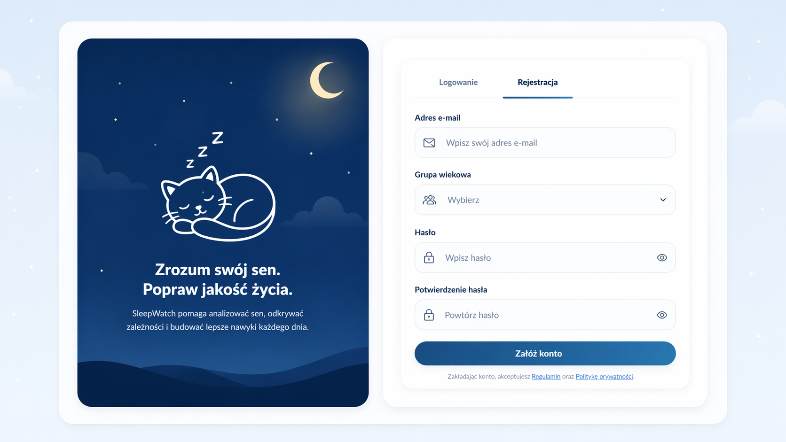
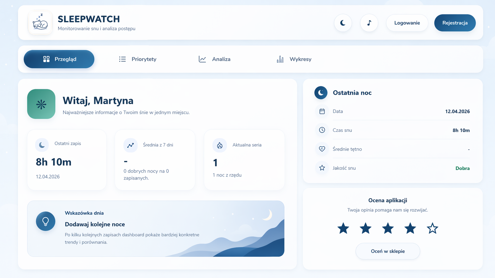
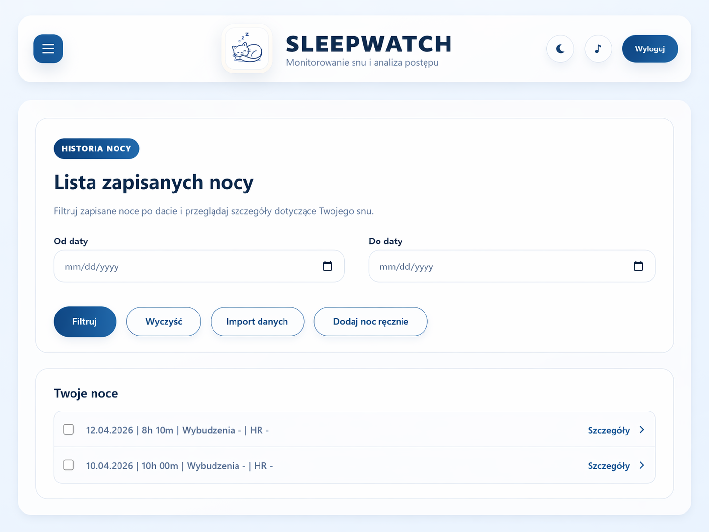
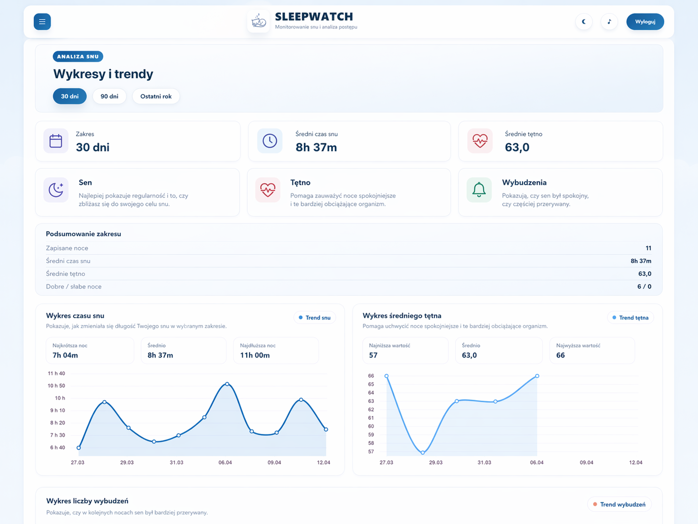

# SleepWatch - dokumentacja ver_1

Stan dokumentu: 2026-04-22
Typ dokumentu: dokumentacja analityczno-projektowa i wdrozeniowa
Link do aplikacji webowej: `https://sleepwatch.onrender.com`

## 1. Cel dokumentu

Celem dokumentu jest zebranie w jednej wersji roboczej (`ver_1`) opisu produktu SleepWatch, jego aktualnych funkcji, architektury, modelu danych, sposobu wdrozenia oraz podejscia do testowania. Dokument ma wspierac dalszy rozwoj aplikacji i ograniczyc naklad pracy przy finalnym oddaniu projektu.

Dokument opisuje przede wszystkim:

- stan aktualnie zaimplementowany,
- funkcje juz dostepne dla uzytkownika i administratora,
- decyzje projektowe widoczne w kodzie,
- elementy planowane lub eksperymentalne, ktore pojawiaja sie w obecnej strukturze projektu.

## 2. Opis systemu

SleepWatch to webowa aplikacja wspierajaca monitorowanie i analize snu. System pozwala rejestrowac konto, aktywowac je przez e-mail, uzupelniac profil, importowac dane snu z plikow CSV, dopisywac notatki do nocy, analizowac trendy i prezentowac podstawowe porownania. W kodzie znajduje sie rowniez warstwa przygotowana do synchronizacji mobilnej przez API oraz funkcje spolecznosciowe zwiazane ze znajomymi.

Glowne obszary systemu:

- konta i autoryzacja,
- profil uzytkownika,
- historia i szczegoly nocy,
- import i synchronizacja danych snu,
- analiza trendow oraz wskazowki,
- panel administratora,
- mobilne API pomocnicze.

## 3. Analiza wymagan

### 3.1 Interesariusze

- uzytkownik koncowy chcacy obserwowac swoj sen,
- administrator systemu,
- zespol projektowy rozwijajacy aplikacje,
- prowadzaca oceniajÄ…ca postep projektu i dokumentacje.

### 3.2 Zakres funkcjonalny obecnej wersji

Na podstawie kodu aplikacji obecnie dostepne sa nastepujace funkcje:

- rejestracja konta z adresem e-mail i haslem,
- aktywacja konta przez link wyslany e-mailem,
- obsluga kont osoby niepelnoletniej z mechanizmem zgody rodzica/opiekuna,
- logowanie loginem lub adresem e-mail,
- reset hasla przez e-mail,
- podglad i edycja profilu,
- wybor awatara, grupy wiekowej, stylu zycia i celu snu,
- wybor preferowanego zrodla synchronizacji,
- import danych snu z plikow CSV,
- automatyczne wykrywanie formatow `SleepWatch CSV`, `Mi Fitness` i `Zepp Life`,
- reczne mapowanie kolumn przy nieznanym formacie CSV,
- reczne dodawanie nocy,
- lista nocy z filtrowaniem po dacie,
- usuwanie zaznaczonych rekordow,
- szczegoly nocy,
- notatki do nocy: jakosc snu, kofeina, drzemka, alkohol, trening, stres, notatka tekstowa,
- automatyczna ocena nocy na podstawie metryk i notatek,
- dashboard z podsumowaniem 7 i 30 dni,
- porownanie miesiaca biezacego do poprzedniego,
- analiza 30, 90 i 365 dni,
- eksperyment miesiaca i hipotezy dotyczace snu,
- proste porownania do podobnych uzytkownikow,
- modul znajomych,
- odznaki i strony pomocnicze typu poranek, wieczor, nawyki, dziennik wnioskow i biblioteka wiedzy,
- endpoint API do synchronizacji snu z aplikacji mobilnej,
- endpointy mobilne do logowania, rejestracji, ustawien i podsumowania,
- panel administratora Django.

### 3.3 Wymagania funkcjonalne

#### WF-01 Rejestracja i aktywacja konta

System musi pozwalac na utworzenie nowego konta na podstawie adresu e-mail i hasla. Po rejestracji konto doroslego uzytkownika pozostaje nieaktywne do czasu klikniecia w link aktywacyjny wyslany e-mailem.

#### WF-02 Obsluga kont niepelnoletnich

System musi rozrozniac konta uzytkownikow ponizej 18 roku zycia. W takim przypadku wymagany jest adres e-mail rodzica lub opiekuna, a aktywacja konta następuje po potwierdzeniu zgody przez osobe dorosla.

#### WF-03 Logowanie i odzyskiwanie dostepu

System musi umozliwiac:

- logowanie loginem,
- logowanie adresem e-mail,
- wylogowanie,
- reset hasla przez wiadomosc e-mail.

#### WF-04 Zarzadzanie profilem

System musi umozliwiac edycje danych profilu:

- nazwa wyswietlana,
- awatar,
- grupa wiekowa,
- poziom aktywnosci fizycznej,
- docelowa liczba godzin snu,
- preferowane zrodlo synchronizacji.

#### WF-05 Import danych snu

System musi przyjmowac pliki CSV zawierajace dane snu, rozpoznawac znane formaty i zapisywac historie importow. W przypadku nieznanego formatu system powinien umozliwic reczne przypisanie kolumn do pol wewnetrznych.

#### WF-06 Reczne dodawanie nocy

System musi pozwalac na dodanie nocy przez formularz zawierajacy date, godzine zasniecia, godzine pobudki oraz liczbe wybudzen. Czas snu jest liczony automatycznie.

#### WF-07 Historia nocy i szczegoly rekordu

System musi prezentowac liste nocy, filtrowanie po zakresie dat oraz ekran szczegolow rekordu.

#### WF-08 Notatki do nocy

System musi pozwalac na zapisanie informacji kontekstowych:

- subiektywna jakosc snu,
- uzycie kofeiny,
- godzina ostatniej kofeiny,
- liczba napojow z kofeina,
- drzemka i jej godzina,
- alkohol,
- trening, jego intensywnosc i godzina,
- poziom stresu,
- notatka tekstowa.

#### WF-09 Analiza i dashboard

System musi budowac podsumowania w oknach czasowych 7 i 30 dni, prezentowac trendy i porownania okresow, a takze generowac proste automatyczne wnioski.

#### WF-10 Porownania i elementy spolecznosciowe

System obecnie zawiera:

- porownanie do podobnych uzytkownikow wedlug grupy wiekowej i stylu zycia,
- modul znajomych z wysylaniem zaproszen, akceptacja i podgladem profilu znajomego.

#### WF-11 Integracja mobilna

System musi udostepniac endpoint `POST /api/sleep/sync/` do odbioru zsynchronizowanych rekordow snu z aplikacji zewnetrznej. Dane sa autoryzowane tokenem API i zapisywane z informacja o providerze oraz urzadzeniu.

### 3.4 Przykladowe scenariusze uzycia

#### Scenariusz A: pierwsze uruchomienie

1. Uzytkownik wchodzi na strone.
2. Zaklada konto, podajac e-mail i haslo.
3. Odbiera wiadomosc aktywacyjna.
4. Aktywuje konto i loguje sie.
5. Uzupelnia profil i ustawia cel snu.

#### Scenariusz B: import danych z opaski

1. Uzytkownik przechodzi do importu snu.
2. Wgrywa plik CSV.
3. System rozpoznaje format lub prosi o mapowanie kolumn.
4. Rekordy zostaja zapisane.
5. Uzytkownik widzi noc na liscie i moze wejsc w szczegoly.

#### Scenariusz C: codzienna obserwacja

1. Uzytkownik otwiera szczegoly ostatniej nocy.
2. Dodaje ocene snu, poziom stresu i notatke.
3. System wylicza automatyczna ocene i aktualizuje dashboard.
4. Na dashboardzie widac trend z 7 i 30 dni.

#### Scenariusz D: synchronizacja mobilna

1. Aplikacja mobilna uzyskuje token API.
2. Wysyla rekordy JSON do `POST /api/sleep/sync/`.
3. Backend tworzy lub aktualizuje rekordy.
4. Profil pokazuje status synchronizacji i ostatnie urzadzenie.

### 3.5 User stories

- Jako uzytkowniczka chce utworzyc konto i aktywowac je przez e-mail, abym mogla bezpiecznie korzystac z aplikacji.
- Jako uzytkowniczka chce importowac dane z Mi Fitness lub Zepp Life, abym nie musiala przepisywac ich recznie.
- Jako uzytkowniczka chce dodawac notatki o kofeinie, stresie i treningu, aby laczyc sen z codziennymi nawykami.
- Jako uzytkowniczka chce widziec trendy z 7 i 30 dni, aby szybciej zauwazac poprawy lub pogorszenia.
- Jako administrator chce miec dostep do panelu administracyjnego, abym mogla nadzorowac konta i dane.
- Jako integracja mobilna chce przeslac rekord snu do backendu, aby historia danych byla aktualna.

### 3.6 Wymagania niefunkcjonalne

#### Wydajnosc

- aplikacja powinna obslugiwac szybkie wyswietlanie dashboardu dla pojedynczego uzytkownika,
- zapytania powinny byc ograniczone do danych zalogowanej osoby,
- import CSV powinien poprawnie obsluzyc wiele rekordow w jednym pliku,
- statystyki agregowane powinny dzialac na poziomie akceptowalnym dla bazy SQLite lokalnie i bazy produkcyjnej w Render.

#### Bezpieczenstwo

- uwierzytelnianie bazuje na mechanizmach Django,
- hasla nie sa przechowywane jawnie,
- reset hasla i aktywacja konta sa realizowane przez tokeny,
- endpoint synchronizacji wymaga tokenu API,
- ciasteczka sesji i CSRF sa oznaczone jako secure poza trybem DEBUG,
- dostep do danych snu jest ograniczony do wlasciciela rekordu.

#### Skalowalnosc

- aplikacja ma architekture modularna (`accounts`, `sleep`),
- wspiera wiele baz danych przez konfiguracje srodowiskowa,
- przygotowano endpointy dla zewnetrznej aplikacji mobilnej,
- mozliwe jest dalsze wydzielenie warstw analitycznych i integracyjnych.

#### Dostepnosc

- aplikacja jest aplikacja webowa dostepna przez przegladarke,
- wdrozenie docelowe przewidziane jest w usludze Render,
- istnieje konfiguracja dla lokalnego rozwoju i srodowiska chmurowego.

#### Utrzymywalnosc

- projekt wykorzystuje standardowy uklad Django,
- formularze, modele i widoki sa rozdzielone na aplikacje,
- w repozytorium znajduja sie testy dla glownego przeplywu kont i snu.

## 4. Projektowanie UX/UI

### 4.1 Zalecenia UX

Produkt powinien odpowiadac na dwa glowne pytania:

- UX: czy uzytkownik rozumie, co ma zrobic i czy przeplyw jest prosty,
- UI: czy interfejs jest czytelny, spojny i wygodny w codziennym uzyciu.

W przypadku SleepWatch szczegolnie wazne sa:

- czytelne komunikaty przy rejestracji i aktywacji,
- prosty import danych,
- szybki dostep do ostatniej nocy,
- zrozumiale wykresy i podsumowania,
- lekkie formularze notatek, bo beda uzupelniane czesto.

### 4.2 Mapa aplikacji

```text
Strona startowa
- Logowanie
- Rejestracja

Po zalogowaniu
- Dashboard
  - Poranek
  - Wieczor
  - Nawyki
  - Wnioski
  - Analiza snu
  - Sen w grupie
  - Biblioteka snu
- Profil
  - Zrodla danych
- Sen
  - Import danych
  - Historia importow
  - Lista nocy
    - Szczegoly nocy
  - Dodaj noc recznie
- Znajomi
  - Profil znajomego
- Osiagniecia
- Admin
```

### 4.3 Sciezki uzytkownika

#### User Journey 1: od rejestracji do dashboardu

Uzytkownik rejestruje konto, aktywuje je przez e-mail, loguje sie, uzupelnia profil i trafia na dashboard, gdzie od razu widzi poziom uzupelnienia profilu oraz podsumowanie snu.

#### User Journey 2: od pliku CSV do analizy

Uzytkownik importuje plik, system zapisuje rekordy, uzytkownik przechodzi do listy nocy, wybiera konkretna noc, dodaje notatke i wraca na dashboard, gdzie widzi automatyczna interpretacje.

#### User Journey 3: codzienne korzystanie

Uzytkownik rano sprawdza ostatnia noc, a wieczorem korzysta z widoku przygotowujacego do snu. Z czasem w dzienniku wnioskow i w analizie pojawiaja sie trendy.

### 4.4 Wireframe low-fidelity

Przykladowy szkic low-fidelity dashboardu:

```text
+------------------------------------------------------+
| Logo | Menu                                          |
+------------------------------------------------------+
| Ostatnia noc | Srednia 7 dni | Srednia 30 dni        |
+------------------------------------------------------+
| Wykres czasu snu                                    |
+------------------------------------------------------+
| Porownanie miesiac do miesiaca                      |
+------------------------------------------------------+
| Wnioski | Alerty | Eksperyment miesiaca             |
+------------------------------------------------------+
```

Przykladowy szkic low-fidelity szczegolow nocy:

```text
+-----------------------------------------+
| Data nocy | dlugosc snu | tetno | SpO2  |
+-----------------------------------------+
| Ocena aplikacji                         |
+-----------------------------------------+
| Formularz notatki                       |
| jakosc snu                              |
| kofeina / drzemka / alkohol / trening   |
| stres                                   |
| notatka tekstowa                        |
+-----------------------------------------+
```

### 4.5 Makieta high-fidelity - zalozenia

W wersji high-fidelity interfejs powinien:

- korzystac ze spojnej kolorystyki kojarzacej sie z nocnym monitoringiem i spokojem,
- wyrózniac najwazniejsze liczby na dashboardzie,
- prezentowac wykresy w prosty, nieprzeciazony sposob,
- stosowac formularze z walidacja i czytelnymi komunikatami,
- zachowac dobra obsluge na laptopie i telefonie.

Przyjeta koncepcja hi-fi dla `ver_1`:

- ekran logowania i dashboard korzystaja z jasnego tla, ciemnych naglowkow i wyraznych kart z metrykami,
- glowna nawigacja pozostaje w gornej czesci ekranu,
- dashboard eksponuje cztery glowne liczby: ostatnia noc, srednia 7 dni, srednia 30 dni i cel snu,
- ekran szczegolow nocy laczy dane liczbowe z formularzem notatki na jednym widoku,
- najwazniejsze komunikaty maja forme kart lub alertow, a nie dlugich blokow tekstu.

### 4.6 Makieta high-fidelity - aktualny zestaw ekranów

Poniżej zamieszczono nowszy zestaw makiet high-fidelity przygotowany dla aktualnej wersji SleepWatch. Zestaw jest bardziej spójny wizualnie niż wcześniejsza plansza i lepiej pokazuje rzeczywiste kierunki interfejsu: jasne tło, granatowe akcenty, ilustrację śpiącego kota oraz czytelne karty z danymi.

Do dokumentacji wybrano pięć ekranów, które najlepiej pokazują najważniejsze obszary aplikacji:

- logowanie,
- rejestrację,
- dashboard,
- historię nocy,
- wykresy i trendy.

#### Ekran 1: logowanie



Opis:

- lewa część ekranu buduje klimat marki i wykorzystuje ilustrację śpiącego kota,
- prawa część skupia się na jednym zadaniu: szybkim zalogowaniu użytkownika,
- formularz jest prosty, czytelny i nie zawiera nadmiarowych elementów rozpraszających.

#### Ekran 2: rejestracja



Opis:

- układ pozostaje spójny z ekranem logowania,
- formularz rejestracji pokazuje podstawowe pola potrzebne do założenia konta,
- makieta zachowuje ten sam język wizualny: biało-granatową kolorystykę, miękkie zaokrąglenia i czytelną hierarchię tekstu.

#### Ekran 3: dashboard



Opis:

- dashboard eksponuje ostatnią noc, najważniejsze liczby i wskazówkę dnia,
- widok został podzielony na czytelne sekcje, aby użytkownik mógł szybko znaleźć podsumowanie snu,
- układ kart i górnej nawigacji pokazuje docelowy kierunek rozwoju interfejsu po zalogowaniu.

#### Ekran 4: historia nocy



Opis:

- ekran historii nocy pokazuje filtrowanie po dacie oraz listę zapisanych rekordów,
- przyciski akcji są skupione przy formularzu filtrowania, co porządkuje przepływ użytkownika,
- makieta podkreśla prostotę obsługi i szybki dostęp do szczegółów konkretnej nocy.

#### Ekran 5: wykresy i trendy



Opis:

- widok trendów pokazuje sposób prezentacji danych w dłuższym okresie,
- sekcja łączy podsumowania liczbowe z wykresami liniowymi i krótkimi opisami metryk,
- dzięki temu użytkownik może jednocześnie zobaczyć wartości zbiorcze i zmiany w czasie.

Podsumowanie zestawu hi-fi:

- wszystkie ekrany utrzymane są w jednej estetyce i wyglądają jak elementy tej samej aplikacji,
- makiety nie są przesadnie marketingowe, tylko zbliżone do realnych ekranów produktu,
- wybrane widoki dobrze nadają się do dokumentacji, bo pokazują zarówno wejście do systemu, jak i późniejsze korzystanie z aplikacji.

### 4.7 Zestaw wireframe'ow ver_1

Ponizej zamieszczono trzy podstawowe wireframe'y tekstowe, ktore w wersji `ver_1` dokumentacji pelnia role makiet niskiej wiernosc i pokazuja uklad kluczowych ekranow.

#### Wireframe 1: ekran logowania i rejestracji

```text
+------------------------------------------------------+
| SleepWatch                                           |
| Zaloguj sie lub utworz konto                         |
+------------------------------------------------------+
| Adres e-mail / login                                 |
| Haslo                                                |
| [ Zaloguj ]                                          |
| Nie masz konta? [ Rejestracja ]                      |
| Nie pamietasz hasla? [ Reset hasla ]                 |
+------------------------------------------------------+
```

#### Wireframe 2: dashboard po zalogowaniu

```text
+--------------------------------------------------------------+
| Logo | Dashboard | Sen | Profil | Analiza | Znajomi          |
+--------------------------------------------------------------+
| Ostatnia noc | Srednia 7 dni | Srednia 30 dni | Cel snu      |
+--------------------------------------------------------------+
| Wykres czasu snu                                             |
+--------------------------------------------------------------+
| Alerty i wskazowki | Eksperyment miesiaca | Analiza danych   |
+--------------------------------------------------------------+
| Szybkie przejscia: Dodaj noc | Import CSV | Lista nocy       |
+--------------------------------------------------------------+
```

#### Wireframe 3: szczegoly nocy i notatka

```text
+------------------------------------------------------+
| Data nocy | czas snu | tetno | SpO2 | wybudzenia     |
+------------------------------------------------------+
| Ocena aplikacji                                      |
| Automatyczne podsumowanie                            |
+------------------------------------------------------+
| Formularz notatki                                    |
| jakosc snu                                           |
| kofeina / godzina / liczba                           |
| drzemka / alkohol / trening / stres                  |
| notatka tekstowa                                     |
| [ Zapisz ]                                           |
+------------------------------------------------------+
```

## 5. Architektura i projekt techniczny

### 5.1 Architektura systemu

SleepWatch wykorzystuje klasyczna architekture warstwowa aplikacji webowej:

- warstwa prezentacji: szablony Django HTML, formularze, routing URL,
- warstwa logiki biznesowej: widoki, walidacje formularzy, uslugi importu i analizy,
- warstwa danych: modele Django ORM i relacyjna baza danych.

### 5.2 Diagram kontekstowy

```text
[Uzytkownik WWW] ---> [Aplikacja SleepWatch] ---> [Baza danych]
         |                    |
         |                    +--> [Usluga e-mail]
         |
[Aplikacja mobilna] ---> [API synchronizacji snu]
```

### 5.3 Diagram komponentow

```text
accounts
- rejestracja
- logowanie
- profil
- aktywacja konta
- reset hasla
- dashboard i strony wspomagajace

sleep
- modele danych snu
- import CSV
- historia importow
- szczegoly nocy i notatki
- API synchronizacji
- uslugi analityczne i walidacyjne

sleepwatch_project
- konfiguracja aplikacji
- routing glowny
- ustawienia srodowiskowe
```

### 5.4 Przeplyw danych

#### Rejestracja

1. Formularz `SignupForm` zbiera dane.
2. Tworzony jest uzytkownik Django.
3. Profil uzupelniany jest o dane dodatkowe.
4. System wysyla e-mail aktywacyjny lub zgody rodzica.
5. Po aktywacji uzytkownik moze sie zalogowac.

#### Import CSV

1. Uzytkownik wgrywa plik CSV.
2. `sleep.services` wykrywa format i mapuje kolumny.
3. System normalizuje dane, waliduje rekordy i zapisuje `SleepRecord`.
4. Powstaje wpis `ImportHistory`.

#### Synchronizacja API

1. Klient mobilny wysyla JSON z rekordami.
2. Token API jest sprawdzany.
3. Dane sa normalizowane.
4. System znajduje rekord po `external_record_id` lub dacie i providerze.
5. Rekord jest tworzony lub aktualizowany.
6. Aktualizowany jest `SleepSyncConnection`.

### 5.5 Baza danych

#### Glowne encje

| Tabela | Cel |
|---|---|
| `auth_user` | konto uzytkownika Django |
| `accounts_userprofile` | rozszerzone dane profilu |
| `accounts_friendship` | relacje znajomych |
| `sleep_sleeprecord` | rekord nocy |
| `sleep_sleepnote` | notatka do nocy |
| `sleep_importhistory` | historia importu plikow |
| `sleep_sleepsyncconnection` | status integracji mobilnych |
| `sleep_sleepapitoken` | token API do synchronizacji |

#### ERD - relacje

```text
User 1 --- 1 UserProfile
User 1 --- N SleepRecord
SleepRecord 1 --- 1 SleepNote
User 1 --- N ImportHistory
User 1 --- N SleepSyncConnection
User 1 --- 1 SleepApiToken
User 1 --- N Friendship (sender)
User 1 --- N Friendship (receiver)
```

#### Schemat logiczny relacji

| Encja glowna | Relacja | Encja powiazana | Znaczenie |
|---|---|---|---|
| `auth_user` | 1:1 | `accounts_userprofile` | kazdy uzytkownik ma jeden profil rozszerzony |
| `auth_user` | 1:N | `sleep_sleeprecord` | jeden uzytkownik moze miec wiele zapisanych nocy |
| `sleep_sleeprecord` | 1:1 | `sleep_sleepnote` | do jednej nocy przypisana jest jedna notatka kontekstowa |
| `auth_user` | 1:N | `sleep_importhistory` | uzytkownik moze wykonac wiele importow danych |
| `auth_user` | 1:N | `sleep_sleepsyncconnection` | profil moze miec kilka zapisanych statusow synchronizacji |
| `auth_user` | 1:1 | `sleep_sleepapitoken` | konto posiada jeden token API do integracji |
| `auth_user` | 1:N | `accounts_friendship` | uzytkownik moze wysylac i odbierac wiele zaproszen znajomosci |

#### Schemat danych - najwazniejsze klucze

| Tabela | Klucz glowny | Klucze obce / powiazania |
|---|---|---|
| `accounts_userprofile` | `id` | `user_id -> auth_user.id` |
| `sleep_sleeprecord` | `id` | `user_id -> auth_user.id` |
| `sleep_sleepnote` | `id` | `sleep_record_id -> sleep_sleeprecord.id`, `user_id -> auth_user.id` |
| `sleep_importhistory` | `id` | `user_id -> auth_user.id` |
| `sleep_sleepsyncconnection` | `id` | `user_id -> auth_user.id` |
| `sleep_sleepapitoken` | `id` | `user_id -> auth_user.id` |
| `accounts_friendship` | `id` | `sender_id -> auth_user.id`, `receiver_id -> auth_user.id` |

#### Opis tabel

`UserProfile`

- `user` - relacja 1:1 z kontem,
- `display_name` - nazwa wyswietlana,
- `avatar` - wybrany awatar,
- `age_group` - grupa wiekowa,
- `is_child_account` - flaga konta dziecka,
- `parent_email` - e-mail rodzica/opiekuna,
- `parental_consent_granted` - status zgody,
- `lifestyle` - styl zycia/aktywnosc,
- `sleep_goal_hours` - docelowa dlugosc snu,
- `preferred_sync_source` - zrodlo danych,
- `active_hypothesis` - eksperyment miesiaca.

`SleepRecord`

- `user` - wlasciciel rekordu,
- `source` - zrodlo danych,
- `sleep_date` - data nocy,
- `bedtime`, `wake_time` - godziny snu,
- `sleep_duration_minutes` - calkowity czas snu,
- `awakenings_count`, `awake_minutes` - przerwania snu,
- `light_sleep_minutes`, `deep_sleep_minutes`, `rem_minutes` - fazy snu,
- `avg_heart_rate`, `min_spo2` - podstawowe metryki biologiczne,
- `raw_data` - dane oryginalne,
- `external_record_id` - identyfikator zrodla zewnetrznego,
- `synced_at`, `device_name` - dane synchronizacji.

`SleepNote`

- `sleep_record` - rekord, którego dotyczy notatka,
- `user` - wlasciciel,
- `sleep_quality` - subiektywna ocena,
- `caffeine_used`, `caffeine_last_time`, `caffeine_count`,
- `nap_taken`, `nap_time`,
- `alcohol`,
- `training_done`, `training_level`, `training_time`,
- `stress_level`,
- `note_text`.

`ImportHistory`

- `user`,
- `source`,
- `file_name`,
- `imported_at`,
- `total_rows`,
- `added_count`,
- `duplicate_count`,
- `error_count`.

### 5.6 Interfejsy zewnetrzne API

#### Web API synchronizacji

`POST /api/sleep/sync/`

Autoryzacja:

- naglowek `Authorization: Bearer <token>`,
- alternatywnie `X-API-Key`.

Protokol i format danych:

- styl komunikacji: REST,
- transport: HTTP/HTTPS,
- format danych: JSON,
- metoda: `POST`,
- odpowiedzi: kody HTTP i obiekty JSON.

Obslugiwani providerzy:

- `health_connect`,
- `zepp_sync`,
- `zepp_life`.

Przykladowy rekord:

```json
{
  "provider": "health_connect",
  "device_name": "Pixel 8",
  "records": [
    {
      "external_id": "hc-001",
      "sleep_date": "2026-04-10",
      "bedtime": "23:20",
      "wake_time": "07:05",
      "sleep_duration_minutes": 465,
      "awake_minutes": 18,
      "light_sleep_minutes": 230,
      "deep_sleep_minutes": 130,
      "rem_minutes": 100,
      "avg_heart_rate": 57,
      "min_spo2": 95
    }
  ]
}
```

#### Mobilne API pomocnicze

W kodzie sa dostepne rowniez endpointy:

- `POST /api/mobile/login/`,
- `POST /api/mobile/signup/`,
- `POST /api/mobile/preferences/`,
- `GET /api/mobile/summary/`.

Zakres odpowiedzialnosci:

- `login` - uwierzytelnienie i wydanie nowego tokenu API,
- `signup` - rejestracja konta z zachowaniem logiki aktywacji,
- `preferences` - zapis preferowanego zrodla synchronizacji,
- `summary` - zwrot podstawowego podsumowania uzytkownika i stanu polaczen.

W aktualnej wersji projektu nie wykorzystuje sie protokolu SOAP.

### 5.7 Technologie i narzedzia

| Obszar | Technologia |
|---|---|
| Backend | Python 3.13, Django 6 |
| Serwer aplikacji | Gunicorn |
| Statyczne pliki | WhiteNoise |
| Baza lokalna | SQLite |
| Alternatywna baza | MySQL / MariaDB |
| Baza produkcyjna | Render PostgreSQL przez `DATABASE_URL` |
| ORM | Django ORM |
| Frontend | Django Templates, HTML, CSS, JavaScript |
| Poczta | backend plikowy Django lub Gmail SMTP |
| Hosting | Render |
| Testy | Django TestCase |
| Kontrola wersji | Git |

## 6. Implementacja i wdrozenie

### 6.1 Opis modulow

#### Modul `accounts`

Odpowiada za:

- rejestracje,
- logowanie,
- aktywacje konta,
- reset hasla,
- profil,
- dashboard,
- widoki pomocnicze,
- znajomych,
- czesc API mobilnego.

#### Modul `sleep`

Odpowiada za:

- rekordy snu,
- import CSV,
- reczne dodawanie nocy,
- notatki do nocy,
- historie importow,
- synchronizacje z aplikacji mobilnej,
- walidacje i automatyczne oceny.

### 6.2 Kluczowe algorytmy

#### Automatyczna ocena nocy

Algorytm wykorzystuje:

- roznice wzgledem celu snu,
- czas czuwania,
- liczbe wybudzen,
- udzial faz snu,
- srednie tetno,
- minimalne SpO2,
- czynniki z notatki, np. stres, kofeina czy alkohol.

Wynik jest normalizowany do skali 0-100 i tlumaczony na etykiete:

- dobra noc,
- srednia noc,
- slaba noc.

#### Detekcja formatu CSV

Algorytm:

1. odczytuje naglowki pliku,
2. porownuje je z aliasami dla wspieranych formatow,
3. wybiera najlepiej dopasowany format,
4. w razie niepowodzenia uruchamia reczne mapowanie.

#### Synchronizacja rekordow z API

Algorytm:

1. waliduje token,
2. normalizuje rekordy,
3. szuka rekordu po `external_record_id`,
4. jesli brak identyfikatora, szuka po dacie i providerze,
5. tworzy nowy rekord lub aktualizuje istniejacy.

### 6.3 Zastosowane wzorce i praktyki

- MVC/MVT zgodny z Django,
- formularze jako warstwa walidacji danych wejsciowych,
- warstwa `services.py` dla logiki importu i synchronizacji,
- ORM zamiast zapytan SQL pisanych recznie,
- wykorzystanie middleware i konfiguracji bezpieczenstwa w `settings.py`.

### 6.4 Instalacja i uruchomienie - srodowisko developerskie

1. Wejsc do katalogu projektu `D:\Aplikacja_SleepWatch`.
2. Zainstalowac zaleznosci:

```powershell
py -m pip install -r requirements.txt
```

3. Skonfigurowac plik `.env`.
4. Wykonac migracje:

```powershell
py manage.py migrate
```

5. Uruchomic serwer:

```powershell
py manage.py runserver
```

6. Otworzyc aplikacje:

```text
http://127.0.0.1:8000/
```

### 6.5 Konfiguracja srodowisk

#### Dev

- `DEBUG=true`,
- SQLite,
- poczta do plikow w `sent_emails`.

#### Test

- baza testowa tworzona przez Django TestCase,
- testy dla przeplywow kont i snu.

#### Prod

- wdrozenie na Render,
- `DEBUG=false`,
- `gunicorn sleepwatch_project.wsgi:application`,
- `collectstatic`,
- `migrate`,
- baza wskazana przez `DATABASE_URL`,
- secure cookies i SSL redirect.

### 6.6 Wdrozenie Render

Aktualna konfiguracja `render.yaml` wskazuje:

- serwis `sleepwatch-app`,
- runtime `python`,
- plan `free`,
- build command `./build.sh`,
- start command `gunicorn sleepwatch_project.wsgi:application`,
- baze `sleepwatch-db`.

## 7. Testowanie i jakosc

### 7.1 Strategia testow

Projekt przewiduje kilka poziomow testowania:

- testy jednostkowe i formularzy,
- testy integracyjne widokow i przeplywow HTTP,
- testy funkcjonalne kluczowych scenariuszy,
- testy API synchronizacji,
- przyszle testy wydajnosciowe i bezpieczenstwa.

### 7.2 Co jest juz przetestowane w repozytorium

Na podstawie plikow `accounts/tests.py` i `sleep/tests.py` pokryte sa m.in.:

- rejestracja i aktywacja konta,
- konto dziecka i zgoda rodzica,
- logowanie i reset hasla,
- edycja profilu,
- znajomi,
- dashboard i analizy,
- import CSV i rozpoznawanie formatow,
- reczne mapowanie kolumn,
- reczne dodawanie nocy,
- walidacja notatek,
- szczegoly nocy,
- API synchronizacji,
- mobilne endpointy pomocnicze.

### 7.3 Przykladowe scenariusze testowe

| ID | Scenariusz | Oczekiwany rezultat |
|---|---|---|
| T-01 | Rejestracja doroslego uzytkownika | konto nieaktywne, e-mail aktywacyjny wyslany |
| T-02 | Rejestracja osoby niepelnoletniej | konto nieaktywne, e-mail do rodzica wyslany |
| T-03 | Aktywacja konta | uzytkownik moze sie zalogowac |
| T-04 | Import poprawnego CSV | rekord i historia importu zapisane |
| T-05 | Import duplikatu | rekord nie jest duplikowany, historia zwieksza `duplicate_count` |
| T-06 | Nieznany uklad CSV | system pokazuje mapowanie kolumn |
| T-07 | Dodanie nocy recznie | czas snu liczony automatycznie |
| T-08 | Dodanie notatki z brakami | walidacja blokuje zapis i pokazuje komunikaty |
| T-09 | Wywolanie API bez tokenu | odpowiedz 401 |
| T-10 | Synchronizacja prawidlowego rekordu | rekord tworzony lub aktualizowany |

### 7.4 Metody zapewnienia jakosci

#### Testy jednostkowe

Sluza do sprawdzania formularzy, walidacji i logiki pomocniczej.

#### Testy integracyjne

Sluza do sprawdzania wspolpracy widokow, modeli, formularzy i routingu.

#### Testy funkcjonalne

Odwzorowuja glowne akcje uzytkownika: rejestracja, import, zapis notatki, analiza.

#### Raport ver_1 - zestawienie wykonanych testow

| Obszar | Rodzaj testu | Narzedzie / sposob wykonania | Wynik |
|---|---|---|---|
| konta i aktywacja | jednostkowy / integracyjny | testy Django `accounts/tests.py` | zaliczone |
| profil i ustawienia | integracyjny | testy Django | zaliczone |
| import CSV | integracyjny / funkcjonalny | testy Django `sleep/tests.py` | zaliczone |
| reczne dodawanie nocy | funkcjonalny | testy Django `sleep/tests.py` | zaliczone |
| notatki do nocy | jednostkowy / funkcjonalny | walidacja formularzy i testy widokow | zaliczone |
| API synchronizacji | integracyjny | testy endpointow backendu | zaliczone |
| mobilne endpointy pomocnicze | integracyjny | testy backendu oraz sprawdzenie przeplywu z aplikacji mobilnej | zaliczone |
| wyglad i przeplywy webowe | przeglad manualny | lokalne uruchomienie aplikacji i kontrola widokow | zaliczone dla `ver_1` |

Wynik ogolny dla `ver_1`: kluczowe przeplywy aplikacji zostaly sprawdzone i nie zglosily bledow blokujacych oddanie wersji roboczej. Obszary wydajnosciowe i bezpieczenstwa pozostaja do dalszego rozszerzenia w kolejnych iteracjach projektu.

#### Testy wydajnosciowe i bezpieczenstwa

W `ver_1` nie zostaly jeszcze sformalizowane jako osobny pakiet testow, ale powinny objac:

- testy obciazenia importu,
- testy odpornosci endpointow API,
- przeglad bezpieczenstwa tokenow i ustawien produkcyjnych.

## 8. Dokumentacja utrzymaniowa

### 8.1 Podrecznik administratora

Administrator powinien:

- miec dostep do `/admin/`,
- zarzadzac kontami i profilami,
- przegladac rekordy snu, notatki i historie importow,
- kontrolowac aktywnosc uzytkownikow oraz dane testowe.

Minimalne kroki:

1. Utworzyc administratora:

```powershell
py manage.py createsuperuser
```

2. Wejsc na:

```text
http://127.0.0.1:8000/admin/
```

3. Korzystac z panelu `SleepWatch Admin`.

Zakres panelu administratora w aktualnym stanie projektu:

- panel jest oparty o standardowy `Django Admin`, a nie o osobny autorski backend,
- dostepny jest pod adresem `/admin/`,
- zarejestrowane sa modele:
- uzytkownicy Django z profilem w `inline`,
- `UserProfile`,
- `SleepRecord`,
- `ImportHistory`,
- `SleepNote`,
- panel pozwala filtrowac, wyszukiwac i edytowac dane tych modeli,
- panel nie ma obecnie osobnych widokow administracyjnych dla `Friendship`, `SleepApiToken` i `SleepSyncConnection`.

### 8.2 Instrukcja uzytkownika

1. Zarejestruj konto.
2. Potwierdz e-mail.
3. Zaloguj sie.
4. Uzupelnij profil.
5. Dodaj noc recznie albo zaimportuj CSV.
6. Wejdz w szczegoly nocy i dodaj notatke.
7. Sprawdz dashboard, analize oraz wnioski.

### 8.3 Historia wersji

| Wersja | Data | Opis |
|---|---|---|
| `ver_1` | 2026-04-22 | pierwsza zebrana dokumentacja projektu oparta o aktualny stan repozytorium |

### 8.4 Plan wsparcia i dalszego rozwoju

Najbardziej naturalne kierunki rozwoju po `ver_1`:

- dalsze rozszerzanie zestawu makiet hi-fi o kolejne ekrany aplikacji,
- rozszerzenie dokumentacji o diagramy graficzne,
- dopisanie jawnej specyfikacji wszystkich endpointow mobilnych,
- testy E2E,
- testy wydajnosciowe,
- spis znanych ograniczen i backlog produktu.

## 9. Stan realizacji funkcji

Ponizsza tabela rozroznia funkcje gotowe, bedace w trakcie rozwoju oraz elementy planowane. To ulatwia ocene, co zostalo juz zaimplementowane, a co nadal pozostaje w backlogu projektu.

| Obszar | Status | Uwagi |
|---|---|---|
| Rejestracja i aktywacja e-mail | gotowe | dziala dla kont doroslych |
| Konto dziecka i zgoda rodzica | gotowe | obslugiwane w przeplywie rejestracji |
| Logowanie i wylogowanie | gotowe | logowanie loginem lub e-mailem |
| Reset hasla | gotowe | wysylka wiadomosci e-mail |
| Profil uzytkownika | gotowe | edycja podstawowych danych i celu snu |
| Import CSV | gotowe | obsluga kilku formatow oraz mapowanie kolumn |
| Historia nocy i szczegoly | gotowe | lista, filtrowanie, szczegoly i notatki |
| Dashboard i analiza 7/30/90/365 dni | gotowe | podstawowe statystyki i wykresy |
| Eksperyment miesiaca | gotowe | hipotezy i automatyczne podsumowanie |
| Synchronizacja przez API | gotowe w warstwie backendowej | przygotowane endpointy i modele |
| Mobilne endpointy pomocnicze | gotowe w warstwie backendowej | logowanie, rejestracja, preferencje, summary |
| Modul znajomych | gotowe | funkcja obecna w aktualnym kodzie |
| Porownania grupowe | w trakcie rozwoju | funkcja uproszczona, wymaga dalszego doprecyzowania produktowego |
| Graficzne makiety hi-fi | gotowe | w `ver_1` dodano zestaw ekranow hi-fi dla logowania, rejestracji, dashboardu, historii nocy i trendow |
| Testy E2E | planowane | brak pelnego scenariusza przegladarkowego |
| Testy wydajnosciowe i bezpieczenstwa | planowane | do rozbudowy w kolejnej wersji dokumentacji |

## 10. Ryzyka i ograniczenia

- w dokumentacji i kodzie widoczne sa dwa kierunki rozwoju produktu: analiza wlasnego snu oraz funkcje spolecznosciowe; w kolejnych wersjach warto doprecyzowac, ktory kierunek jest priorytetowy,
- nie wszystkie elementy UX sa jeszcze opisane graficznie, dlatego kolejne wersje dokumentacji powinny rozszerzac zestaw makiet o dalsze widoki aplikacji,
- lokalne uruchamianie zalezy od poprawnej konfiguracji `.env`,
- wsparcie dla wielu providerow mobilnych wymaga dalszej walidacji integracyjnej,
- unikalnosc `external_record_id` moze zachowywac sie inaczej zaleznosci od silnika bazy danych.

## 11. Zalaczniki

### 11.1 Glowna struktura repozytorium

```text
accounts/
docs/
sleep/
sleepwatch_project/
static/
templates/
manage.py
requirements.txt
render.yaml
README.md
```

### 11.2 Materialy przekazywane razem z dokumentacja

Do oddania nalezy przygotowac:

- plik Word z dokumentacja (`.docx`),
- pliki aktualnego stanu aplikacji,
- link do wersji webowej aplikacji,
- opcjonalnie wersje zrodlowa dokumentacji w Markdown.

### 11.3 Podsumowanie

SleepWatch w aktualnej postaci jest dzialajaca aplikacja webowa Django do monitorowania snu z naciskiem na konto uzytkownika, historie nocy, notatki, import i podstawowa analityke. Projekt posiada juz solidna baze pod dalszy rozwoj produktu oraz formalizacji dokumentacji technicznej i projektowej.

## 12. Forma oddania

Zgodnie z trescia polecenia do oddania nalezy przekazac:

- dokumentacje aplikacji w wersji pliku MS Word,
- pliki aktualnego stanu aplikacji,
- link do aplikacji opublikowanej w sieci.

W obecnym repozytorium przygotowano:

- plik Word: `docs/SleepWatch_Dokumentacja_ver_1.docx`,
- wersje zrodlowa dokumentacji: `docs/SleepWatch_Dokumentacja_ver_1.md`,
- aktualny kod aplikacji w tym samym repozytorium,
- link do wdrozenia aplikacji na Renderze: `https://sleepwatch.onrender.com`.

Aktualnie publicznie dostepna wersja aplikacji webowej SleepWatch jest wdrozona w usludze Render pod adresem:

`https://sleepwatch.onrender.com`
